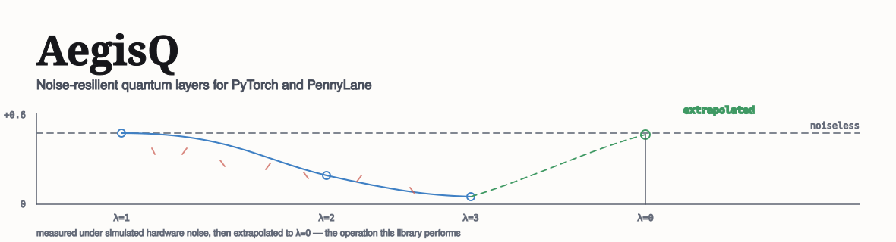
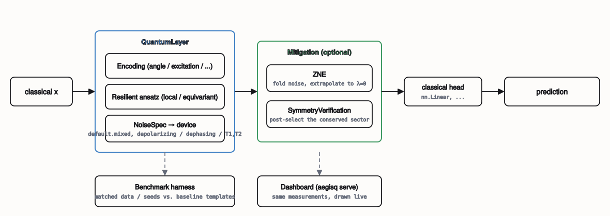

<p>
  
  
  
  
  
  <a href="LICENSE"></a>
</p>

> **Built for the Microsoft AI/ML Summer Internship Programme, 2026.**
> Capstone project by **Egemen Sarıaslan**, covering problem framing, implementation, benchmarking and write-up. Carried out under the supervision of Microsoft Cloud Solution Architects Management.
>
> <sub>A capstone project produced during the programme. Not a Microsoft product, not affiliated with or endorsed by Microsoft Corporation; Microsoft and Azure are their trademarks.</sub>

A drop-in PyTorch and PennyLane library for quantum neural network layers that stay trainable and accurate on noisy hardware, plus the mitigation, benchmarking and measurement tooling to prove they do.

The name is the thesis. An *aegis* is a shield, and the shield here is not one trick but four, layered because each catches what the others miss: **ansaetze** that keep gradient signal at width instead of a barren plateau, **mitigation** wrappers that recover the zero-noise answer from noisy measurements, **symmetry verification** that turns a circuit's own conservation law into a free error detector, and a **benchmark harness** that puts every claim next to the standard baseline under identical conditions.

| | component | extra circuit cost? |
|---|---|---|
| **Layers** | resilient ansatz catalog — local, particle-conserving, equivariant | none — same circuit, different template |
| **ZNE** | zero-noise extrapolation via unitary folding or virtual noise scaling | *N*x circuit executions |
| **Symmetry verification** | post-selection on a quantity the circuit already conserves | one richer measurement, zero extra circuits |
| **Benchmark harness** | matched data / seeds / optimiser against standard PennyLane templates | — |

Every model here runs on PennyLane's `default.mixed` density-matrix simulator under realistic depolarizing, dephasing, amplitude-damping and thermal-relaxation noise, and the whole library installs with `pip install -e .` — no quantum hardware account, no cloud queue.



<sub>Encoding → resilient ansatz → noise model → optional mitigation → classical head, with the same layer feeding the benchmark harness and the live dashboard.</sub>

---

## Table of contents

- [1. The problem](#1-the-problem)
- [2. Results](#2-results)
- [3. The components](#3-the-components)
- [4. How gradients survive mitigation](#4-how-gradients-survive-mitigation)
- [5. Where resilience costs you](#5-where-resilience-costs-you)
- [6. Engineering](#6-engineering)
- [7. Running it](#7-running-it)
- [8. Repository layout](#8-repository-layout)
- [9. Known limitations](#9-known-limitations)
- [10. References](#10-references) · [Licence and citation](#licence-and-citation) · [Author](#author)

---

## 1. The problem

Standard variational ansaetze — `BasicEntanglerLayers`, `StronglyEntanglingLayers` — were designed for expressivity on an ideal device. They entangle every wire, every layer, often with long-range gates that need a SWAP chain to run on real, linearly-connected hardware.

On NISQ hardware that design backfires. Long-range entanglers accumulate error faster than they accumulate useful correlations; cost landscapes flatten as depth grows; and the standard global-parity cost function used to report expressivity is exactly the one the barren-plateau literature identifies as the worst case for gradient variance. The result is a model that looks expressive on paper and is untrainable in simulation once realistic noise is switched on — and the failure is silent: nothing raises an error, the loss just stops moving.

The design decision taken before writing any of this: **treat noise resilience as a first-class constraint on the ansatz, not a mitigation bolted on afterward.** Every resilient layer in this library is built to keep its gradient signal and its error budget under control at the circuit level; ZNE and symmetry verification then recover what noise still gets through.

---

## 2. Results

Every table below is regenerated by the command named beside it — `python3 run.py <subcommand>` for the short form, or the matching `examples/*.py` script for the full sweep. A fresh clone reproduces all of them with no dataset to fetch and no quantum hardware account, so nothing here can drift from what the code actually produces.

### Barren plateaus — gradient variance vs. register width

`python3 run.py plateau --qubits 4,6,8,10 --samples 60` — 4 layers, 60 random initialisations, mean per-parameter gradient variance.

| ansatz | n=4 | n=6 | n=8 | n=10 | decay | circuit params (n=10) |
|---|---|---|---|---|---|---|
| StronglyEntangling *(baseline)* | 5.9e-03 | 9.3e-04 | 1.4e-04 | 3.0e-05 | **0.005** | 120 |
| BasicEntangler *(baseline)* | 7.6e-03 | 1.8e-03 | 2.6e-04 | 6.1e-05 | **0.008** | 40 |
| `LocalEntangler` | 8.3e-03 | 3.3e-03 | 1.8e-03 | 1.1e-03 | **0.127** | 80 |
| `PermutationEquivariant` | 1.6e-01 | 1.5e-01 | 1.5e-01 | 1.5e-01 | **0.952** | 12 |

`decay = var(n=10) / var(n=4)`. The baselines lose more than two orders of magnitude of gradient signal between 4 and 10 qubits. The localised ansatz loses roughly a factor of 8; the equivariant one, whose parameter count does not grow with width, loses essentially nothing.

The metric averages over every circuit angle rather than pinning one index, which matters more than it sounds: a rotation that commutes through everything downstream of it — a final `RZ` before a `Z` measurement — has an identically zero derivative for algebraic reasons. Singling one out would report a barren plateau where there is only a symmetry.

### Zero-noise extrapolation — how much bias comes back

`.venv/bin/python examples/02_zero_noise_extrapolation.py` — 4 qubits, 3 layers, global folding, same weights on the ideal and noisy circuits. `python3 run.py zne` prints a shorter version.

| depolarizing `p` | raw error | Richardson (1,2,3) | Richardson (1,3,5) | exponential (1,2,3) | linear (1,2) |
|---|---|---|---|---|---|
| 0.005 | 0.078 | +62% | **+94%** | +92% | +82% |
| 0.01 | 0.141 | +75% | +76% | **+85%** | +66% |
| 0.02 | 0.233 | +63% | +45% | **+69%** | +41% |
| 0.04 | 0.329 | **+28%** | +15% | +26% | +15% |

Percentages are the fraction of the noisy circuit's error removed. Recovery falls as noise grows, to about a quarter of the error by `p=0.04`, and wider scale-factor sets help at low noise but hurt at high noise, where the amplified circuits retain too little signal to fit. Mitigation is not free either — the extrapolator's own `noise_amplification` reports the sampling-variance cost: 3.0x for two scale factors, 7.0x for three, 31.0x for five.

### The full benchmark — including where the resilient layers lose

`python3 run.py benchmark` — 4 qubits, 3 layers, 120 samples, 10 epochs, mean of 2 seeds.

| model | noiseless | depolarizing | thermal | hardware_like |
|---|---|---|---|---|
| BasicEntangler *(baseline)* | 3.7e-03 | 3.1e-04 | 1.5e-03 | 1.7e-03 |
| StronglyEntangling *(baseline)* | 4.0e-03 | 4.9e-04 | 1.9e-03 | 2.1e-03 |
| `LocalEntangler` | 7.7e-03 | 3.0e-03 | 5.2e-03 | 5.5e-03 |
| `PermutationEquivariant` | 2.9e-02 | 8.5e-03 | 1.8e-02 | 1.9e-02 |
| `LocalEntangler` + ZNE | 7.7e-03 | **7.2e-03** | 7.0e-03 | 7.3e-03 |

Depolarizing noise costs the unmitigated localised layer 60% of its gradient variance (7.7e-03 → 3.0e-03); wrapped in ZNE it loses 6% (7.7e-03 → 7.2e-03). The mitigation restores trainability, not only the expectation values — the sharper self-critique of what accuracy alone hides is in [§5](#5-where-resilience-costs-you).

### Symmetry verification — error detection for free

`.venv/bin/python examples/04_symmetry_verification.py` — 4 qubits, particle-conserving circuit in the weight-2 sector. `python3 run.py symmetry` covers the first three rows.

| depolarizing `p` | leakage out of sector | acceptance rate | raw error | verified error |
|---|---|---|---|---|
| 0.005 | 0.315 | 0.685 | 0.068 | **0.024** |
| 0.01 | 0.466 | 0.534 | 0.116 | **0.062** |
| 0.02 | 0.580 | 0.420 | 0.176 | **0.140** |
| 0.05 | 0.624 | 0.376 | 0.247 | 0.239 |

The noiseless circuit leaks exactly zero probability out of its sector, so every count outside it is measured noise. Post-selecting costs no extra circuit executions — only a full-distribution measurement — but the acceptance rate is the shot overhead: `1/0.534 ≈ 1.9x` more shots at `p=0.01`.

---

## 3. The components

### 3.1 Resilient layer catalog

| ansatz | key idea | 2q gates / layer | params / layer | conserves |
|---|---|---|---|---|
| `local_entangler` | brickwork nearest-neighbour only; two-qubit depth of 2 per layer regardless of width | `n-1` | `2n` | — |
| `particle_conserving` | Givens rotations; state confined to one Hamming-weight sector | `n-1` | `2n-1` | particle number |
| `equivariant` | all wires share one angle, all bonds share one coupling | `n` | `3` | cyclic permutation |
| `z2_equivariant` | `RX` + `IsingZZ`; commutes with `X^⊗n` | `n-1` | `2n-1` | X-basis parity |
| `basic_entangler` | `pennylane.BasicEntanglerLayers` | `n` | `n` | — |
| `strongly_entangling` | `pennylane.StronglyEntanglingLayers` | `n` | `3n` | — |

The last two are baselines, included so the benchmark harness can compare against them under an identical noise model. The design choices behind the other four: no long-range gates (`local_entangler` never wraps the chain, so it maps onto linear connectivity with no SWAP routing), a local cost function by default (`measurement="local_z"` rather than the global parity the barren-plateau literature treats as the hard case), and symmetry as a resource (a preserved quantity shrinks the variational manifold *and* gives noise somewhere to be caught — [§3.2](#32-error-mitigation-wrappers)).

→ [§5](#5-where-resilience-costs-you) is the honest bill for these choices.

### 3.2 Error mitigation wrappers

```python
from aegisq import ZNE, SymmetryVerification
```

`ZNE(layer, scale_factors=..., extrapolate=..., folding=...)` runs the layer at several amplified noise levels and extrapolates to zero. `folding="global"` amplifies noise by unitary folding, `U → U U† U` — how ZNE is done on real hardware, needing no knowledge of the noise model. `folding="noise"` rescales the simulated channel rates directly instead, the *virtual* variant: cheaper, exact by construction (channel composition, not a first-order approximation), simulator-only. Extrapolators: `richardson` (default), `polynomial(degree=…)`, `linear`, `exponential`.

`SymmetryVerification(layer)` post-selects a probability measurement onto the sector the circuit's symmetry allows, and reports the retained weight via `sector_weight(x)`.

Both are `nn.Module`s holding the layer as a submodule: parameters register once, `state_dict` round-trips, `.to()` / `.train()` propagate normally.

### 3.3 Noise models

```python
from aegisq.noise import NoiseSpec, get_preset

spec = get_preset("hardware_like")          # composite superconducting-style profile
spec = get_preset("thermal_relaxation", t1=50_000, t2=30_000, gate_time=200)
spec = NoiseSpec(depolarizing_1q=0.001, depolarizing_2q=0.01, readout=0.02)
```

Depolarizing, dephasing (phase damping), amplitude damping, T1/T2 thermal relaxation, readout bit-flip. Channels are selected by gate *arity*, not a hard-coded gate list, so custom templates and folded/adjointed gates pick up noise correctly while state preparations stay ideal. `NoiseSpec` is a frozen, picklable dataclass, scalable via `spec.scaled(λ)` — what virtual ZNE is built on.

### 3.4 Benchmark harness

```python
from aegisq.benchmark import standard_benchmark

result = standard_benchmark(n_qubits=4, n_layers=3, epochs=20, seeds=(0, 1, 2))
print(result.summary())
```

Trains every model under every noise profile with identical data, seeds, optimiser and epoch budget, reporting test accuracy, gradient variance at initialisation, two-qubit gate count and circuit evaluations per forward pass. Datasets (`two_moons`, `circles`, `parity`, `linearly_separable`) are numpy-only and rescale into the range where angle encodings stay injective.

---

## 4. How gradients survive mitigation

The requirement the library is organised around: wrapping execution in a mitigation routine must not break backpropagation.

**Extrapolation is a fixed linear map.** For a given set of scale factors, Richardson and least-squares polynomial extrapolation to zero noise are linear in the measured expectation values, with coefficients depending only on the scale factors. AegisQ precomputes them once at construction, so mitigation in the training loop is a single `sum(c_i · E_i)` — a tensor contraction autograd traverses like any other, with nothing to sever. The test suite verifies this term by term: the gradient through `ZNE` equals `Σ c_i · ∇E_i` computed independently, to 1e-9.

**The exponential model stays inside autograd too**, fitted in closed form by regressing `log|E − asymptote|` on `λ`. Where its assumptions fail — a sign change between scale factors, a magnitude that grows with noise — each output element falls back to a linear extrapolation rather than a divergent estimate; `extrapolator.validity(values)` reports how much of the output the exponential model actually handled.

**Parameter-shift and backprop agree.** `diff_method` defaults to `"backprop"` analytically and `"parameter-shift"` with finite `shots`; the suite checks both produce the same gradients on a noisy circuit to 1e-6, and that backprop matches central finite differences.

**Precision.** PennyLane's mixed-state simulator builds its density matrix from torch's *global* default dtype, not the dtype of your parameters — a float64 layer would otherwise still simulate in single precision, carrying ~1e-7 of numerical noise per expectation value. `QuantumLayer(..., dtype=torch.float64)` pins the default dtype for the circuit call and restores it after.

---

## 5. Where resilience costs you

The sharpest criticism of a noise-resilient layer catalog is that resilience is bought with expressivity, and on the right target that trade goes badly. So it is measured here rather than argued around.

`LocalEntangler`'s default CZ entangler is diagonal — it writes correlations into phase, which a single-qubit `⟨Z_i⟩` read-out cannot see directly. On `parity`, a maximally non-local 4-qubit task, the failure is total and *silent*: identical, wrong accuracy at every noise level, because the model never learned at all, not because noise degraded it.

| configuration | parity test accuracy |
|---|---|
| `LocalEntangler`, CZ, `local_z` *(defaults)* | 0.569 |
| `LocalEntangler`, **CNOT**, `local_z` | **1.000** |
| `LocalEntangler`, CZ, **`global_z`** | **1.000** |
| `LocalEntangler`, CZ, `local_zz` | 0.750 |
| BasicEntangler *(reference)* | 1.000 |

A CNOT ladder moves parity into the computational basis; a global `Z⊗…⊗Z` observable reads it off wholesale. Either fix recovers the task — `python3 run.py choose-ansatz` reproduces this table. The default stays CZ because it is native on most superconducting hardware and holds gradient variance better as the register grows (decay from 4 to 8 qubits: 0.20 for CZ, 0.11 for CNOT), but **if the target depends on all qubits at once, one of those two knobs has to change.**

`PermutationEquivariant` fails the same way for a different reason: on `two_moons` it scores 0.71–0.76 against 0.94–0.97 for every other model, because three shared parameters per layer cannot express an asymmetric 2-D decision boundary. Equivariance pays only when the data actually has the symmetry — and like the CZ failure above, nothing warns you when it doesn't.

Gradient variance separates these models reliably at the widths this library reaches; test accuracy needs either a harder task or a wider register than a laptop density-matrix simulation can run.

---

## 6. Engineering

**265 tests**, covering the differentiability guarantees (gradients through mitigation match an independent calculation to 1e-9), the noise-channel algebra, the benchmark harness end to end, the CLI, the zero-prerequisite launcher on a bare interpreter, and the dashboard's data layer and accessibility contract (WCAG AA contrast on every design theme, checked from the CSS tokens rather than eyeballed).

**Reproducible from a clone.** Every number in [§2](#2-results) is produced by the command printed next to it, on `default.mixed` — no dataset to fetch, no quantum hardware account, no cloud queue.

**CI** runs the suite, the console entry point and a standalone wheel install across Ubuntu and macOS on Python 3.10–3.13, plus a job that runs the two-command launcher against a completely bare checkout to keep that claim honest.

**The interactive dashboard** (`aegisq serve`) is `http.server` and hand-written SVG — no web framework, no CDN, no build step — with four switchable design directions that each redefine the full colour/type/layout token set, not just a palette swap.

---

## 7. Running it

Needs nothing but a Python 3 interpreter — no environment to build by hand, no package manager to install first.

```bash
git clone https://github.com/egemensariaslan/aegisq.git && cd aegisq
python3 run.py            # builds an isolated environment, runs a live measured demo
```

`run.py` tries an existing install, then an existing `.venv`, then [uv](https://docs.astral.sh/uv/) (on `PATH`, via pip, or downloaded as a release binary using only the standard library), then plain `venv` + pip — whichever gets there first. About 40 seconds the first time, a few seconds after that.

```bash
python3 run.py serve              # the interactive dashboard
python3 run.py benchmark --quick  # resilient layers vs. standard templates
python3 run.py choose-ansatz      # reproduces §5
uv run --extra dev pytest -q      # the full test suite, ~20 seconds
```

### The dashboard

Seven panels at `http://127.0.0.1:8765`, each measured live and each printing the command that reproduces it:

| panel | what it shows |
|---|---|
| Zero-noise extrapolation | measured points, three fitted models, the exact noiseless value — mean ± s.d. over independent trials with real error bars |
| Barren plateaus | gradient variance vs. register width on a log axis |
| Signal retained | a scale-free contraction factor under rising noise, mitigated vs. unmitigated |
| Symmetry verification | leakage out of the conserved sector and what post-selection recovers |
| Live training | a real Adam loop under a hardware noise model, streamed epoch by epoch |
| Layer catalog | two-qubit gate count, parameter count and depth per layer |
| Known limits | §5, in the browser |

---

## 8. Repository layout

```
src/aegisq/
├── layers/        ansatz catalog, encodings, measurements, QuantumLayer
├── mitigation/     ZNE extrapolators, symmetry verification
├── noise/          NoiseSpec, hardware-like presets
├── benchmark/      datasets, trainability metrics, the sweep harness
├── ui/             dashboard backend (experiments, HTTP server) + hand-written frontend
├── cli.py          aegisq command line (demo, benchmark, plateau, zne, serve, ...)
└── run.py          zero-prerequisite launcher (repository root)

examples/           six runnable scripts, one per measured result above
tests/              265 tests
docs/               this README's diagrams
```

---

## 9. Known limitations

Listed here rather than left for a reviewer to find.

- **Resilience trades away expressivity**, and the failure is silent. `LocalEntangler`'s default CZ entangler cannot fit a globally-correlated target ([§5](#5-where-resilience-costs-you)); `PermutationEquivariant` cannot fit data without its symmetry. Neither raises an error — the model just trains to chance.
- **Density-matrix simulation costs `4^n` memory.** Practical up to roughly 10–12 qubits on a laptop; `measurement="probs"` (needed for symmetry verification) is the tightest of these.
- **`ZNE(folding="global")` cannot fold a state preparation**, so `encoding="amplitude"` requires `folding="noise"` instead. The error message says so.
- **`SymmetryVerification` covers particle-number and computational-basis parity.** Verifying `z2_equivariant`'s X-basis parity needs a basis change before measurement — a circuit change, not a wrapper.
- **`diff_method="parameter-shift"` gradients fall outside the double-precision scope**, since its tapes re-execute during `backward()`. That path targets finite-shot execution, where sampling noise dominates anyway.
- **No real quantum hardware run.** Every noise model is a calibrated simulation (`default.mixed`); nothing here has been measured against an actual NISQ device or cloud queue.

---

## 10. References

Work this project builds on directly.

1. Temme, K., Bravyi, S. & Gambetta, J. M. (2017). *Error Mitigation for Short-Depth Quantum Circuits.* Physical Review Letters. [arXiv:1612.02058](https://arxiv.org/abs/1612.02058) — the zero-noise extrapolation method `ZNE` implements.
2. McClean, J. R., Boixo, S., Smelyanskiy, V. N., Babbush, R. & Neven, H. (2018). *Barren plateaus in quantum neural network training landscapes.* Nature Communications. [arXiv:1803.11173](https://arxiv.org/abs/1803.11173) — the phenomenon the resilient ansatz catalog is built against.
3. Cerezo, M., Sone, A., Volkoff, T., Cincio, L. & Coles, P. J. (2021). *Cost function dependent barren plateaus in shallow parametrized quantum circuits.* Nature Communications. [arXiv:2001.00550](https://arxiv.org/abs/2001.00550) — the reason `measurement="local_z"` is the default rather than a global observable.
4. Kandala, A., Mezzacapo, A., Temme, K., Takita, M., Brink, M., Chow, J. M. & Gambetta, J. M. (2017). *Hardware-efficient variational quantum eigensolver for small molecules and quantum magnets.* Nature. — the hardware-efficient ansatz lineage `strongly_entangling` and `basic_entangler` follow.
5. Schuld, M., Sweke, R. & Meyer, J. J. (2021). *Effect of data encoding on the expressive power of variational quantum machine learning models.* Physical Review A. [arXiv:2008.08605](https://arxiv.org/abs/2008.08605) — the framing behind the encoding catalog in [§3.3](#33-noise-models).
6. Bergholm, V. et al. (2018). *PennyLane: Automatic differentiation of hybrid quantum-classical computations.* [arXiv:1811.04968](https://arxiv.org/abs/1811.04968) — the simulation and autodiff substrate this library is built on.

---

## Licence and citation

Everything — source, examples and docs — is under the **Apache License 2.0** ([LICENSE](LICENSE)). Permissive, OSI-approved, with an express patent grant.

> Sarıaslan, E. (2026). *AegisQ: Noise-Resilient Quantum Neural Network Layers for PyTorch and PennyLane* (Version 0.1.0) [Computer software].

If you cite a specific measurement, please say which one — the gradient-variance figures are at initialisation, the accuracy figures are after training, and they answer different questions.

## Author

**Egemen Sarıaslan** — Microsoft AI/ML Summer Internship Programme, 2026,
supervised by Cloud Solution Architects Management.

Questions about the design choices — or [§5](#5-where-resilience-costs-you) in particular — are welcome as issues.
